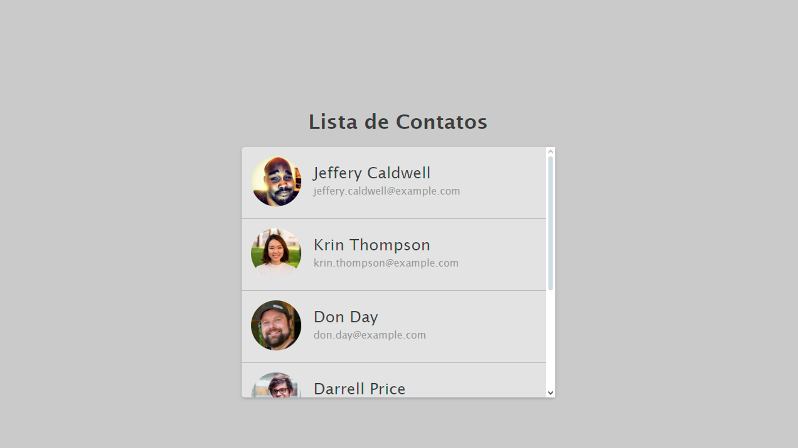
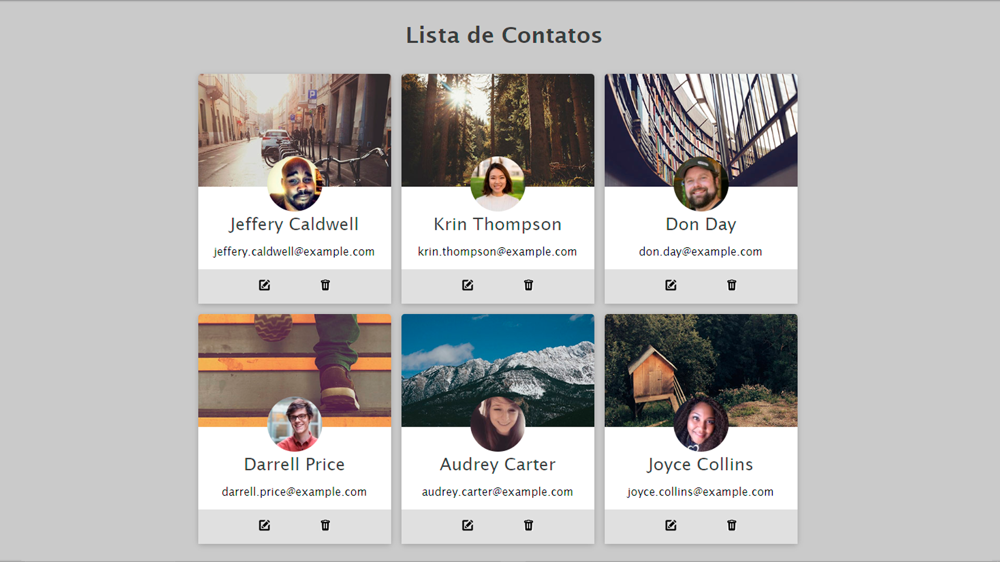

Contact List is a study project focused on working with HTML lists (ul and li) to create a structured contact list. The project has two versions, both using CSS for styling:

Version 1: A simple contact list with basic styling.

Version 2: A more refined version with improved CSS, enhancing the layout and visual appeal.

**[See Page Version 1](https://luigineryproject2ver1.netlify.app)** 
**[See Page Version 2](https://luigineryproject2ver2.netlify.app)** 

